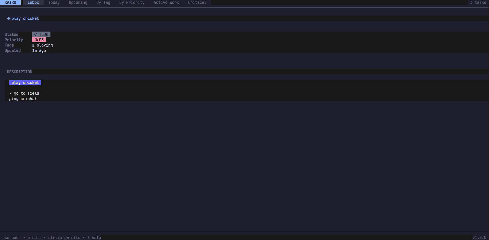
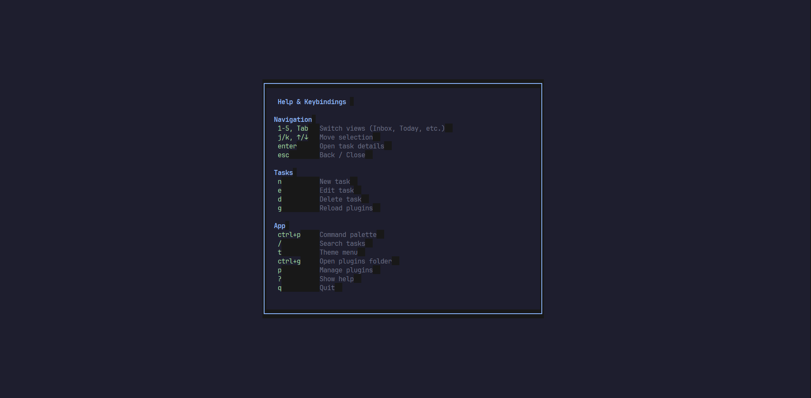
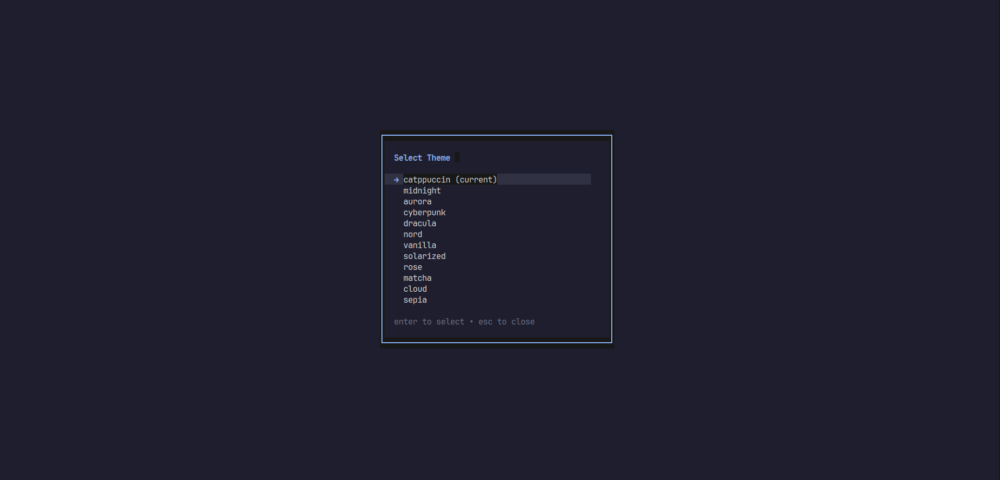

# 📝 Kairo


[](https://github.com/programmersd21/kairo/actions)
[](https://goreportcard.com/report/github.com/programmersd21/kairo)
[](https://opensource.org/licenses/MIT)

**⌛ Time, executed well.**

---

⚡ Kairo is a keyboard-first, offline-first terminal task manager designed for focused execution. Built with [Bubble Tea](https://github.com/charmbracelet/bubbletea), [Lip Gloss](https://github.com/charmbracelet/lipgloss), and SQLite.

## ✨ Features

- **Task Engine:** Title, description (Markdown), tags, priority, deadline, status.
- **Views:** Inbox, Today, Upcoming, Tag, Priority.
- **Command Palette:** Ranked fuzzy search for tasks, commands, and tags.
- **Offline Storage:** SQLite with WAL + migrations for reliability and speed.
- **Git Sync:** Repo-backed, per-task JSON files, auto-commit, pull/push.
- **Plugins:** Lua-based commands and views with hot-reload.
- **Import/Export:** Support for JSON and Markdown.
- **Theming:** Built-in and user-definable theme overrides with runtime switching.

## 📸 Screenshots

| Task Description | Help Menu | Theme Menu |
| :---: | :---: | :---: |
|  |  |  |

## 🏗 Architecture

Kairo is built with a modular architecture designed for performance, extensibility, and data sovereignty.

### 🧩 Core Components

- **UI Layer ([Bubble Tea](https://github.com/charmbracelet/bubbletea)):** An Elm-inspired functional TUI framework. Kairo uses a state-machine approach to manage different modes (List, Detail, Editor, Palette) and sub-component communication.
- **Storage Layer (SQLite):** A robust local database using `modernc.org/sqlite` (pure Go). It features WAL (Write-Ahead Logging) for concurrent access and a migration system for schema evolution.
- **Sync Engine (Git):** A unique "no-backend" synchronization strategy. It serializes tasks into individual JSON files within a local Git repository, leveraging Git's branching and merging capabilities for conflict resolution and versioning.
- **Search Engine:** An in-memory index utilizing a ranked fuzzy matching algorithm. It provides sub-millisecond search results by weighting matches based on contiguity and word boundaries.
- **Plugin System ([Gopher-Lua](https://github.com/yuin/gopher-lua)):** A lightweight Lua VM integration. It allows users to extend the TUI with custom commands and views without recompiling the binary.

### 🔄 Data Flow

1.  **Interaction:** User input is captured by the Bubble Tea loop and dispatched to the active component.
2.  **Persistence:** Changes are immediately persisted to the SQLite database.
3.  **Synchronization:** If enabled, the Sync Engine periodically (or on-demand) exports database state to the Git-backed task files and performs `git pull/push` operations.
4.  **Extensibility:** Lua plugins can hook into the task creation/deletion lifecycle and inject new items into the command palette.

## 🚀 Installation


```bash
kairo/
├── CHANGELOG.md
├── cmd
├── CODE_OF_CONDUCT.md
├── configs
│   └── kairo.example.toml
├── CONTRIBUTING.md
├── go.mod
├── go.sum
├── internal
│   ├── app
│   │   ├── model.go
│   │   └── msg.go
│   ├── config
│   │   ├── config.go
│   │   └── config_test.go
│   ├── core
│   │   ├── codec
│   │   │   ├── json.go
│   │   │   └── markdown.go
│   │   ├── core_test.go
│   │   ├── ids.go
│   │   ├── nlp
│   │   │   └── deadline.go
│   │   ├── task.go
│   │   └── view.go
│   ├── plugins
│   │   └── host.go
│   ├── search
│   │   ├── fuzzy.go
│   │   ├── fuzzy_test.go
│   │   └── index.go
│   ├── storage
│   │   ├── migrations.go
│   │   ├── repo.go
│   │   └── repo_test.go
│   ├── sync
│   │   └── engine.go
│   ├── ui
│   │   ├── detail
│   │   │   └── model.go
│   │   ├── editor
│   │   │   └── model.go
│   │   ├── help
│   │   │   └── model.go
│   │   ├── keymap
│   │   │   ├── keymap.go
│   │   │   ├── keymap_test.go
│   │   │   ├── normalize.go
│   │   │   └── normalize_test.go
│   │   ├── palette
│   │   │   └── model.go
│   │   ├── plugin_menu
│   │   │   └── model.go
│   │   ├── styles
│   │   │   └── styles.go
│   │   ├── tasklist
│   │   │   └── model.go
│   │   ├── theme
│   │   │   └── theme.go
│   │   └── theme_menu
│   │       └── model.go
│   └── util
│       ├── paths.go
│       └── util_test.go
├── LICENSE
├── Makefile
├── plugins
│   └── sample.lua
├── README.md
├── SECURITY.md
└── VERSION.txt
```

## 🚀 Installation

### Prerequisites

- Go **1.26+**

### Build from source

```bash
git clone https://github.com/programmersd21/kairo.git
cd kairo
make build
```

For a static binary (pure Go SQLite driver, no CGO):

```bash
CGO_ENABLED=0 make build
```

## 🛠 Usage

Run the binary:

```bash
./kairo
```

## ⌨️ Keybindings

Kairo is designed for keyboard efficiency. All keybindings are configurable in your `config.toml`.

### Global & Navigation
| Key | Action |
| :--- | :--- |
| `ctrl+p` | Open Command Palette (fuzzy search tasks, tags, and commands) |
| `/` | Search tasks (fuzzy by name) |
| `tab` | Cycle to next view (Inbox → Today → Upcoming → ...) |
| `shift+tab` | Cycle to previous view |
| `t` | Open Theme Menu / Cycle themes |
| `ctrl+g` | Open Lua plugins folder |
| `p` | Manage plugins (list & uninstall) |
| `g` | Reload all Lua plugins |

| `?` | Show Help overlay |
| `q` | Quit Kairo |

### Task List (Normal Mode)
| Key | Action |
| :--- | :--- |
| `k` / `up` | Move selection up |
| `j` / `down` | Move selection down |
| `g` / `home` | Jump to top of list |
| `G` / `end` | Jump to bottom of list |
| `pgup` / `pgdown` | Scroll page up/down |
| `n` | Create a new task |
| `e` | Edit selected task |
| `d` | Delete selected task (requires confirmation) |
| `enter` | View detailed task information & Markdown description |

### View Switching (Quick Keys)
| Key | View |
| :--- | :--- |
| `1` | **Inbox:** All active tasks |
| `2` | **Today:** Tasks due today or overdue |
| `3` | **Upcoming:** Tasks with future deadlines |
| `4` | **Tag:** Filter tasks by a specific tag |
| `5` | **Priority:** Filter tasks by priority level (P0-P3) |

### Task Editor & Detail View
| Key | Action |
| :--- | :--- |
| `ctrl+s` | Save changes (in Editor) |
| `tab` | Move to next input field |
| `shift+tab` | Move to previous input field |
| `esc` | Cancel / Go back to list |

> **Pro Tip:** In the Command Palette (`ctrl+p`), you can type commands like `pri:0` to jump to Priority 0 tasks, or `#work` to jump to a specific tag.

## ⚙️ Configuration

Copy the example configuration to your configuration directory:

- **Windows:** `%APPDATA%\kairo\config.toml`
- **macOS:** `~/Library/Application Support/kairo/config.toml`
- **Linux:** `~/.config/kairo/config.toml`

Example:
```bash
cp configs/kairo.example.toml ~/.config/kairo/config.toml
```

## 🔄 Git Sync

Enable sync in your `config.toml` and set `sync.repo_path` to a local git repository.

Kairo uses a distributed approach:
- Each task is stored as an individual JSON file.
- Changes are committed locally automatically.
- Manual sync: `kairo sync`

## 🔌 Plugins (Lua)

Kairo's plugin system allows you to extend the TUI with custom logic, views, and commands. Place `.lua` files in your plugins directory (e.g., `~/.config/kairo/plugins/`).

### Plugin Structure
Every plugin must return a table containing its metadata and optional `commands` and `views`.

#### Metadata Fields
| Field | Type | Description |
| :--- | :--- | :--- |
| `id` | `string` | Unique identifier (defaults to filename) |
| `name` | `string` | Display name in Plugin Manager |
| `description` | `string` | Short summary of plugin features |
| `author` | `string` | Plugin author name |
| `version` | `string` | Current version (e.g., "1.0.0") |

```lua
return {
    id = "my-plugin",
    name = "Example Plugin",
    description = "A simple example plugin",
    author = "Kairo Developer",
    version = "1.0.0",
    -- ... commands and views ...
}
```

### `kairo` Global API
The following functions are available to all plugins:

#### Tasks
- `kairo.create_task(table)`: Create a task. Fields: `title`, `description`, `status`, `priority`, `tags` (table). Returns created task.
- `kairo.get_task(id)`: Retrieve a task by ID. Returns task table or `nil`.
- `kairo.update_task(id, patch_table)`: Update a task. Returns updated task.
- `kairo.delete_task(id)`: Permanently remove a task.
- `kairo.list_tasks(filter_table)`: Query tasks. Filter fields: `statuses` (table), `tag`, `priority` (number), `sort`.

#### UI
- `kairo.notify(message, is_error)`: Push a message to the status bar.

#### Example: "Cleanup" Command
```lua
-- plugins/cleanup.lua
return {
    id = "cleanup",
    name = "Auto Cleanup",
    description = "Removes all DONE tasks with a single command",
    commands = {
        {
            id = "run-cleanup",
            title = "Cleanup: Remove Done",
            run = function()
                local tasks = kairo.list_tasks({statuses = {"done"}})
                for _, t in ipairs(tasks) do
                    kairo.delete_task(t.id)
                end
                kairo.notify("Cleanup complete!", false)
            end
        }
    }
}
```

#### Example: "Focus" View
```lua
-- plugins/focus.lua
return {
    id = "focus",
    name = "Focus Mode",
    views = {
        {
            id = "active-high-pri",
            title = "🔥 Focus",
            filter = {
                statuses = {"doing"},
                min_priority = 0,
                sort = "deadline"
            }
        }
    }
}
```

### Sorting Modes
When defining a view filter or listing tasks, you can use: `"deadline"`, `"priority"`, `"updated"`, or `"created"`.


## 🤝 Contributing

Contributions are welcome! Please see [CONTRIBUTING.md](CONTRIBUTING.md) for guidelines and [CODE_OF_CONDUCT.md](CODE_OF_CONDUCT.md) for our code of conduct.

## 📜 License

Kairo is released under the [MIT License](LICENSE).

---

## 🗺 Roadmap

- [ ] Incremental DB-to-UI streaming for large datasets.
- [ ] Conflict-free sync via an append-only event log.
- [ ] Sandboxed Plugin SDK.
- [ ] Smart suggestions and spaced repetition.
- [ ] Multi-workspace support with encryption at rest.
