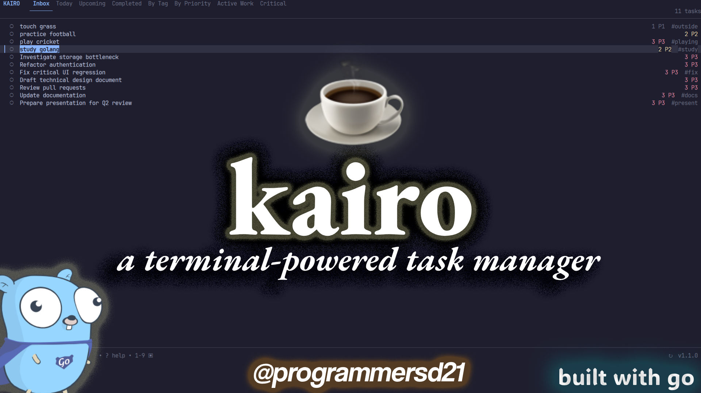

<div align="center">

# 📝 Kairo — 🌿 Minimal, powerful task management.



[](https://github.com/programmersd21/kairo/releases)
[](https://github.com/programmersd21/kairo/actions)
[](https://goreportcard.com/report/github.com/programmersd21/kairo)
[](https://opensource.org/licenses/MIT)

**⌛ Time, executed well.**

</div>

---

### ✨ A Premium Terminal Task Manager Designed for Focused Execution

🏃🏻 **Kairo** is a *lightning-fast*, **keyboard-first** task management application  
built for developers and power users.

It combines the simplicity of a **command-line tool**  
with the sophistication of a *modern, premium design system*.

🎯 **Instant Responsiveness** — Sub-millisecond task searching and navigation  
🎨 **Premium UI Design** — Modern color palette with accessibility at its core  
⌨️ **Keyboard-First** — Complete control without ever touching a mouse  
🖥️ **Seamless Rendering** — Pixel-perfect background fills the entire viewport, no terminal bleed-through  
🔐 **Offline-First** — Your data lives locally in SQLite, always under your control  
🔗 **Git-Backed Sync** — Optional distributed sync leveraging Git's architecture  
🧩 **Extensible** — Unified Lua plugin system and CLI automation API  
📱 **Responsive Layout** — Gracefully adapts to any terminal size  
🤖 **Automation-Friendly** — Headless API for external scripts and CI/CD  

Built with [Bubble Tea](https://github.com/charmbracelet/bubbletea) (TUI framework), [Lip Gloss](https://github.com/charmbracelet/lipgloss) (terminal styling), and SQLite (local storage).

---

## ✨ Core Features

| Feature | Description |
|---------|-------------|
| **Task Service** | Single source of truth for TUI, Lua, and CLI automation |
| **Lua Plugins** | Native first-class scripting with event hooks (GopherLua) |
| **Automation API** | Stable CLI interface for external control and JSON integration |
| **Event Hooks** | React to task creation, updates, and app lifecycle events |
| **Smart Filtering** | Multiple views: Inbox, Today, Upcoming, Completed, by Tag, by Priority |
| **Fuzzy Search** | Lightning-fast command palette with ranked results |
| **Strike Animation** | Visual feedback when completing tasks with 'z' |
| **Offline Storage** | SQLite with WAL for reliability and concurrent access |
| **Git Sync** | Optional repository-backed sync with per-task JSON files |
| **Import/Export** | JSON and Markdown support for data portability |

---

## 🤩 Star History

<a href="https://www.star-history.com/?repos=programmersd21%2Fkairo&type=date&legend=top-left">
 <picture>
   <source media="(prefers-color-scheme: dark)" srcset="https://api.star-history.com/chart?repos=programmersd21/kairo&type=date&theme=dark&legend=top-left" />
   <source media="(prefers-color-scheme: light)" srcset="https://api.star-history.com/chart?repos=programmersd21/kairo&type=date&legend=top-left" />
   
 </picture>
</a>

---

## 📦 Installation

### macOS (Homebrew)

```bash
brew tap programmersd21/kairo
brew install kairo
```

### Linux / macOS (curl)

```bash
curl -fsSL https://raw.githubusercontent.com/programmersd21/kairo/main/scripts/install.sh | bash
```

Installs to `$HOME/.local/bin/kairo` (fallback: `/usr/local/bin/kairo`) and attempts to persist the PATH update in your shell profile when needed.

### Windows (PowerShell)

```powershell
iwr -useb https://raw.githubusercontent.com/programmersd21/kairo/main/scripts/install.ps1 | iex
```

Installs to `%USERPROFILE%\\AppData\\Local\\Programs\\kairo\\kairo.exe` and adds the install directory to your user PATH.

## For any OS out of these:

```bash
go install github.com/programmersd21/kairo/cmd/kairo@latest
```

**OR** use the [PREBUILTS](https://https://github.com/programmersd21/kairo/releases).

### Updates

```bash
kairo update
```

Downloads the latest GitHub Release for your OS/arch, verifies it against `checksums.txt`, and safely replaces the installed binary.
On Windows, the update is applied after `kairo update` exits; run `kairo` again once it completes.

---

## 🤖 Automation & CLI API

Kairo provides a stable CLI API for external automation. Every operation available in the TUI can be performed via the `api` subcommand.

### Usage

```bash
# List tasks with a specific tag
kairo api list --tag work

# Create a new task
kairo api create --title "Finish report" --priority 1

# Update a task
kairo api update --id <task-id> --status done

# Advanced JSON interface
kairo api --json '{"action": "create", "payload": {"title": "API Task", "tags": ["bot"]}}'
```

### Other CLI Commands

```bash
# Check installed version
kairo version

# Update to the latest version
kairo update

# Export tasks
kairo export --format json --out tasks.json
kairo export --format markdown --out tasks.md

# Import tasks
kairo import --format json --in tasks.json

# Shell completion (bash, zsh, fish, powershell)
# Automatic install:
kairo completion zsh install

# Manual install (add to your shell profile):
# source <(kairo completion zsh)
kairo completion zsh

# Get help for any command
kairo help
kairo help api
kairo help export

# Sync with Git (if configured)
kairo sync
```

---

## 🔌 Plugins (Lua)

Extend Kairo with custom logic, event hooks, commands, and views using Lua.

### Plugin Structure

```lua
-- plugins/my-plugin.lua
local plugin = {
    id = "my-plugin",
    name = "My Plugin",
    description = "Reacts to tasks",
    version = "1.0.0",
}

-- Hook into events
kairo.on("task_create", function(event)
    kairo.notify("New task: " .. event.task.title)
end)

-- Register custom commands
plugin.commands = {
    { id = "hello", title = "Say Hello", run = function() kairo.notify("Hello!") end }
}

return plugin
```

### Supported Events
- `task_create`
- `task_update`
- `task_delete`
- `app_start`
- `app_stop`

### Lua API Reference

| Method | Description |
|--------|-------------|
| `kairo.create_task(table)` | Create a new task |
| `kairo.update_task(id, table)` | Update an existing task |
| `kairo.delete_task(id)` | Delete a task |
| `kairo.list_tasks(filter)` | List tasks with optional filter |
| `kairo.on(event, function)` | Register an event listener |
| `kairo.notify(msg, is_error)` | Send a notification to the UI |

---

## 🎨 Design System

Kairo features a **minimalist design system** optimized for clarity and focus.

### Design Philosophy

- **Breathable Layout** — Reduced padding and thin borders for a clean, modern look
- **Seamless Backdrop** — Custom rendering engine ensures the theme background covers the entire terminal window
- **Instant Feedback** — Smooth strikethrough animations when completing tasks
- **Keyboard-First** — All interactions optimized for speed
- **High Compatibility** — Uses standard Unicode symbols for consistent rendering across all terminals

---

## ⌨️ Keyboard Navigation

### Essential Commands

| Shortcut | Action |
|----------|--------|
| `ctrl+p` | 🔍 Open Command Palette |
| `z` | ⚡ **Strike (toggle completion with animation)** |
| `tab` / `shift+tab` | → / ← Switch views |
| `n` | ➕ Create new task |
| `e` | ✏️ Edit selected task |
| `enter` | 👁️ View task details |
| `d` | 🗑️ Delete task |
| `t` | 🎨 Cycle themes |
| `?` | ❓ Show help menu |
| `q` | ❌ Quit |

### Plugin Menu Shortcuts

| Shortcut | Action |
|----------|--------|
| `enter` | 👁️ View plugin details |
| `u` | 🗑️ Uninstall plugin |
| `o` | 📂 Open plugins folder |
| `r` | 🔄 Reload plugins |
| `p` / `esc` | ❌ Close menu |

### View Shortcuts

| Shortcut | View |
|----------|------|
| `1` - `9` | **Switch Views** — Instant access to all tabs (Inbox, Today, Plugins, etc.) |
| `f` | **Tag Filter** — Quickly jump to Tag View and filter by name |
| `tab` / `shift+tab` | **Cycle Views** — Move through all available tabs |

### Pro Tips
- Press `f` to open the **tag filter input modal** for direct tag entry
- Type tag name and press `enter` to apply filter, or `esc` to cancel
- Type `#tag` in the command palette to jump to a specific tag
- Type `pri:0` to filter tasks by priority level
- Use `ctrl+s` to save while editing
- Press `esc` to cancel and return to the list

---

## ⚙️ Configuration

### Config Location

| OS | Path |
|----|------|
| **Windows** | `%APPDATA%\kairo\config.toml` |
| **macOS** | `~/Library/Application Support/kairo/config.toml` |
| **Linux** | `~/.config/kairo/config.toml` |

### Quick Setup

```bash
cp configs/kairo.example.toml ~/.config/kairo/config.toml
```

Then edit to customize:
- **Theme selection** — Choose from 12 built-in themes:
    - **Dark:** Catppuccin (Default), Midnight, Aurora, Cyberpunk, Dracula, Nord
    - **Light:** Vanilla, Solarized, Rose, Matcha, Cloud, Sepia
- **Keybindings** — Rebind any keyboard shortcut
- **View ordering** — Customize your task view tabs
- **Sync settings** — Configure Git repository sync

---

## 🔄 Git Sync

Enable optional distributed sync by setting `sync.repo_path` in your config.

Kairo uses a unique no-backend approach:
- Each task is stored as an individual JSON file
- Changes are committed locally with automatic messages
- Perform sync manually or on-demand
- Git's branching and merging handle conflicts transparently

```bash
# Manual sync
kairo sync
```

---

## 🏗 Architecture

Kairo is built with a modular architecture designed for performance, extensibility, and data sovereignty.

### Core Components

| Component | Role |
|-----------|------|
| **Task Service** | Single source of truth for TUI, Lua, and CLI automation |
| **UI Layer** ([Bubble Tea](https://github.com/charmbracelet/bubbletea)) | Elm-inspired TUI framework with state-machine pattern for mode management |
| **Storage** (SQLite) | Pure Go database with WAL for reliability and concurrent access |
| **Sync Engine** (Git) | Distributed "no-backend" sync with per-task JSON files |
| **Search** (Fuzzy Index) | In-memory ranked matching with sub-millisecond results |
| **Plugins** ([Gopher-Lua](https://github.com/yuin/gopher-lua)) | Lightweight Lua VM for user extensions |

### Data Flow

```
User Input/API/Lua → Task Service → Hooks System
    ↓
Immediate DB Persistence → Optional Git Sync
    ↓
UI Re-render → Instant User Feedback
```

---

## 🌴 Project Structure

```
.
├── CHANGELOG.md
├── cmd
│   └── kairo
│       └── main.go
├── CODE_OF_CONDUCT.md
├── configs
│   └── kairo.example.toml
├── CONTRIBUTING.md
├── go.mod
├── go.sum
├── internal
│   ├── api
│   │   └── api.go
│   ├── app
│   │   ├── model.go
│   │   └── msg.go
│   ├── buildinfo
│   │   └── buildinfo.go
│   ├── completion
│   │   └── completion.go
│   ├── config
│   │   ├── config.go
│   │   └── config_test.go
│   ├── core
│   │   ├── codec
│   │   │   ├── json.go
│   │   │   └── markdown.go
│   │   ├── core_test.go
│   │   ├── ids.go
│   │   ├── nlp
│   │   │   └── deadline.go
│   │   ├── task.go
│   │   └── view.go
│   ├── hooks
│   │   └── hooks.go
│   ├── lua
│   │   └── engine.go
│   ├── plugins
│   │   └── host.go
│   ├── search
│   │   ├── fuzzy.go
│   │   ├── fuzzy_test.go
│   │   └── index.go
│   ├── service
│   │   └── service.go
│   ├── storage
│   │   ├── migrations.go
│   │   ├── repo.go
│   │   └── repo_test.go
│   ├── sync
│   │   └── engine.go
│   ├── ui
│   │   ├── detail
│   │   │   └── model.go
│   │   ├── editor
│   │   │   └── model.go
│   │   ├── help
│   │   │   └── model.go
│   │   ├── keymap
│   │   │   ├── keymap.go
│   │   │   ├── keymap_test.go
│   │   │   ├── normalize.go
│   │   │   └── normalize_test.go
│   │   ├── palette
│   │   │   └── model.go
│   │   ├── plugin_menu
│   │   │   └── model.go
│   │   ├── render
│   │   │   └── render.go
│   │   ├── styles
│   │   │   └── styles.go
│   │   ├── tasklist
│   │   │   └── model.go
│   │   ├── theme
│   │   │   └── theme.go
│   │   └── theme_menu
│   │       └── model.go
│   ├── updater
│   │   ├── checksums.go
│   │   ├── download.go
│   │   ├── extract.go
│   │   ├── github.go
│   │   ├── updater.go
│   │   └── windows_helper.go
│   └── util
│       ├── paths.go
│       └── util_test.go
├── LICENSE
├── Makefile
├── plugins
│   ├── auto-cleanup.lua
│   ├── auto-tagger.lua
│   ├── sample.lua
│   └── task-logger.lua
├── README.md
├── screenshots
│   └── thumbnail.png
├── scripts
│   ├── install.ps1
│   └── install.sh
├── SECURITY.md
└── VERSION.txt
```

---

## 🤝 Contributing

We welcome contributions! Please see [CONTRIBUTING.md](CONTRIBUTING.md) for guidelines and [CODE_OF_CONDUCT.md](CODE_OF_CONDUCT.md) for our code of conduct.

### Areas for Contribution
- ✨ New themes and design improvements
- 🐛 Bug fixes and performance enhancements
- 📚 Documentation and tutorials
- 🧩 Plugins and extensions
- 🌍 Translations and localization

---

## 💙 Community Legend(s)

- **@Tornado300** — Contributed significantly by reporting issues that led to multiple critical bug fixes.

---

## 📜 License

Kairo is released under the [MIT License](LICENSE).

---

## 🗺 Roadmap

- [ ] Multi-workspace support with encryption at rest
- [ ] Incremental DB-to-UI streaming for large datasets
- [ ] Conflict-free sync via append-only event log
- [ ] Sandboxed Plugin SDK
- [ ] Smart suggestions and spaced repetition
- [ ] Enhanced mobile/SSH terminal support
- [ ] Community plugin marketplace

---

## 💡 Philosophy

Kairo is built on the belief that task management should be **fast, simple, and under your control**. We prioritize:

✅ **Your Privacy** — Data stays on your machine  
✅ **Your Freedom** — Open source, MIT licensed  
✅ **Your Time** — Lightning-fast interactions  
✅ **Your Experience** — Premium, thoughtful design  

Every feature is carefully considered to maintain focus and avoid complexity creep.

---

## 📞 Support

- 🐛 Report bugs on [GitHub Issues](https://github.com/programmersd21/kairo/issues)
- 💬 Discuss ideas on [GitHub Discussions](https://github.com/programmersd21/kairo/discussions)
- ⭐ Show your support with a star!

---

**Made with ❤️ for focused execution. Start organizing your time today.**
