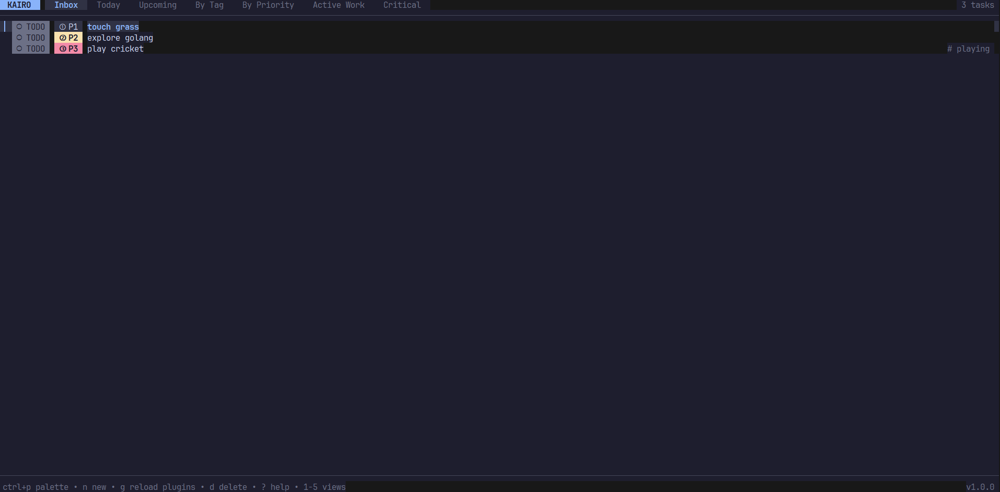

# 📝 Kairo



[](https://github.com/programmersd21/kairo/actions)
[](https://goreportcard.com/report/github.com/programmersd21/kairo)
[](https://opensource.org/licenses/MIT)

**⌛ Time, executed well.**

---

### A Premium Terminal Task Manager Designed for Focused Execution

Kairo is a lightning-fast, keyboard-first task management application built for developers and power users. It combines the simplicity of a command-line tool with the sophistication of a modern, premium design system.

🎯 **Instant Responsiveness** — Sub-millisecond task searching and navigation  
🎨 **Premium UI Design** — Modern color palette with accessibility at its core  
⌨️ **Keyboard-First** — Complete control without ever touching a mouse  
🔐 **Offline-First** — Your data lives locally in SQLite, always under your control  
🔗 **Git-Backed Sync** — Optional distributed sync leveraging Git's architecture  
🧩 **Extensible** — Lua-based plugins for custom workflows  
📱 **Responsive Layout** — Gracefully adapts to any terminal size  

Built with [Bubble Tea](https://github.com/charmbracelet/bubbletea) (TUI framework), [Lip Gloss](https://github.com/charmbracelet/lipgloss) (terminal styling), and SQLite (local storage).

---

## ✨ Core Features

| Feature | Description |
|---------|-------------|
| **Task Engine** | Title, description (Markdown), tags, priority levels, deadlines, status tracking |
| **Smart Filtering** | Multiple views: Inbox, Today, Upcoming, Completed, by Tag, by Priority |
| **Fuzzy Search** | Lightning-fast command palette with ranked results |
| **Strike Animation** | Visual feedback when completing tasks with 'z' |
| **Offline Storage** | SQLite with WAL for reliability and concurrent access |
| **Git Sync** | Optional repository-backed sync with per-task JSON files |
| **Lua Plugins** | Extend the app with custom commands and views |
| **Import/Export** | JSON and Markdown support for data portability |
| **Modern Themes** | 4 built-in themes (Midnight, Dracula, Nord, Paper) with user customization |
| **Minimalist UI** | Breathable, clean design system with standard Unicode compatibility |

---

## 🎨 Design System

Kairo features a **minimalist design system** optimized for clarity and focus.

### Design Philosophy

- **Breathable Layout** — Reduced padding and thin borders for a clean, modern look
- **Instant Feedback** — Smooth strikethrough animations when completing tasks
- **Keyboard-First** — All interactions optimized for speed
- **High Compatibility** — Uses standard Unicode symbols for consistent rendering across all terminals

---

## ⌨️ Keyboard Navigation

### Essential Commands

| Shortcut | Action |
|----------|--------|
| `ctrl+p` | 🔍 Open Command Palette |
| `z` | ⚡ **Strike (toggle completion with animation)** |
| `tab` / `shift+tab` | → / ← Switch views |
| `n` | ➕ Create new task |
| `e` | ✏️ Edit selected task |
| `enter` | 👁️ View task details |
| `d` | 🗑️ Delete task |
| `t` | 🎨 Cycle themes |
| `?` | ❓ Show help menu |
| `q` | ❌ Quit |

### View Filters

| Shortcut | View |
|----------|------|
| `1` | **Inbox** — Active tasks |
| `2` | **Today** — Due today |
| `3` | **Upcoming** — Future deadlines |
| `4` | **Completed** — Done tasks |
| `5` | **Tags** — Filter by tag |
| `6` | **Priority** — Filter by priority |

### Pro Tips
- Type `#tag` in the command palette to jump to a specific tag
- Type `pri:0` to filter tasks by priority level
- Use `ctrl+s` to save while editing
- Press `esc` to cancel and return to the list

---

## ⚙️ Configuration

### Config Location

| OS | Path |
|----|------|
| **Windows** | `%APPDATA%\kairo\config.toml` |
| **macOS** | `~/Library/Application Support/kairo/config.toml` |
| **Linux** | `~/.config/kairo/config.toml` |

### Quick Setup

```bash
cp configs/kairo.example.toml ~/.config/kairo/config.toml
```

Then edit to customize:
- **Theme selection** — Choose from 12 built-in themes:
    - **Dark:** Catppuccin (Default), Midnight, Aurora, Cyberpunk, Dracula, Nord
    - **Light:** Vanilla, Solarized, Rose, Matcha, Cloud, Sepia
- **Keybindings** — Rebind any keyboard shortcut
- **View ordering** — Customize your task view tabs
- **Sync settings** — Configure Git repository sync

---

## 🔄 Git Sync

Enable optional distributed sync by setting `sync.repo_path` in your config.

Kairo uses a unique no-backend approach:
- Each task is stored as an individual JSON file
- Changes are committed locally with automatic messages
- Perform sync manually or on-demand
- Git's branching and merging handle conflicts transparently

```bash
# Manual sync
kairo sync
```

---

## 🏗 Architecture

Kairo is built with a modular architecture designed for performance, extensibility, and data sovereignty.

### Core Components

| Component | Role |
|-----------|------|
| **UI Layer** ([Bubble Tea](https://github.com/charmbracelet/bubbletea)) | Elm-inspired TUI framework with state-machine pattern for mode management |
| **Storage** (SQLite) | Pure Go database with WAL for reliability and concurrent access |
| **Sync Engine** (Git) | Distributed "no-backend" sync with per-task JSON files |
| **Search** (Fuzzy Index) | In-memory ranked matching with sub-millisecond results |
| **Plugins** ([Gopher-Lua](https://github.com/yuin/gopher-lua)) | Lightweight Lua VM for user extensions |

### Data Flow

```
User Input → Bubble Tea Loop → Active Component
    ↓
Immediate DB Persistence → Optional Git Sync
    ↓
UI Re-render → Instant User Feedback
```

---

## 🔌 Plugins (Lua)

Extend Kairo with custom commands and views using Lua. Place `.lua` files in your plugins directory.

### Plugin Metadata

```lua
return {
    id = "my-plugin",
    name = "My Custom Plugin",
    description = "Does something awesome",
    author = "You",
    version = "1.0.0",
    -- commands and views defined below
}
```

### API: Tasks

```lua
-- Create, read, update, delete tasks
kairo.create_task({title, description, status, priority, tags})
kairo.get_task(id)
kairo.update_task(id, {title, status, ...})
kairo.delete_task(id)
kairo.list_tasks({statuses, tag, priority, sort})
```

### API: UI

```lua
-- Send notifications to the user
kairo.notify(message, is_error)
```

### Example: Cleanup Command

```lua
-- plugins/cleanup.lua
return {
    id = "cleanup",
    name = "Cleanup Done Tasks",
    description = "Removes all completed tasks",
    commands = {
        {
            id = "run-cleanup",
            title = "Cleanup: Remove Done",
            run = function()
                local tasks = kairo.list_tasks({statuses = {"done"}})
                for _, t in ipairs(tasks) do
                    kairo.delete_task(t.id)
                end
                kairo.notify("Cleanup complete!", false)
            end
        }
    }
}
```

---

## 🌴 Project Structure

```
kairo/
├── cmd/kairo/              # Main entry point
├── internal/
│   ├── app/                # Application state & messages
│   ├── core/               # Task model & core logic
│   ├── config/             # Configuration parsing
│   ├── storage/            # SQLite repository
│   ├── sync/               # Git sync engine
│   ├── search/             # Fuzzy search index
│   ├── plugins/            # Lua plugin host
│   └── ui/                 # Terminal UI components
│       ├── styles/         # Premium design system
│       ├── theme/          # Color themes
│       ├── tasklist/       # Main task list view
│       ├── detail/         # Task detail view
│       ├── editor/         # Task editor
│       ├── palette/        # Command palette
│       ├── keymap/         # Keyboard bindings
│       ├── help/           # Help overlay
│       ├── theme_menu/     # Theme switcher
│       └── plugin_menu/    # Plugin manager
├── configs/                # Example configuration
├── plugins/                # Sample plugins
├── DESIGN_SYSTEM.md        # Complete design documentation
├── CONTRIBUTING.md         # Contributing guidelines
└── README.md               # This file
```

---

## 🤝 Contributing

We welcome contributions! Please see [CONTRIBUTING.md](CONTRIBUTING.md) for guidelines and [CODE_OF_CONDUCT.md](CODE_OF_CONDUCT.md) for our code of conduct.

### Areas for Contribution
- ✨ New themes and design improvements
- 🐛 Bug fixes and performance enhancements
- 📚 Documentation and tutorials
- 🧩 Plugins and extensions
- 🌍 Translations and localization

---

## 📜 License

Kairo is released under the [MIT License](LICENSE).

---

## 🗺 Roadmap

- [ ] Multi-workspace support with encryption at rest
- [ ] Incremental DB-to-UI streaming for large datasets
- [ ] Conflict-free sync via append-only event log
- [ ] Sandboxed Plugin SDK
- [ ] Smart suggestions and spaced repetition
- [ ] Enhanced mobile/SSH terminal support
- [ ] Community plugin marketplace

---

## 💡 Philosophy

Kairo is built on the belief that task management should be **fast, simple, and under your control**. We prioritize:

✅ **Your Privacy** — Data stays on your machine  
✅ **Your Freedom** — Open source, MIT licensed  
✅ **Your Time** — Lightning-fast interactions  
✅ **Your Experience** — Premium, thoughtful design  

Every feature is carefully considered to maintain focus and avoid complexity creep.

---

## 📞 Support

- 🐛 Report bugs on [GitHub Issues](https://github.com/programmersd21/kairo/issues)
- 💬 Discuss ideas on [GitHub Discussions](https://github.com/programmersd21/kairo/discussions)
- ⭐ Show your support with a star!

---

**Made with ❤️ for focused execution. Start organizing your time today.**
